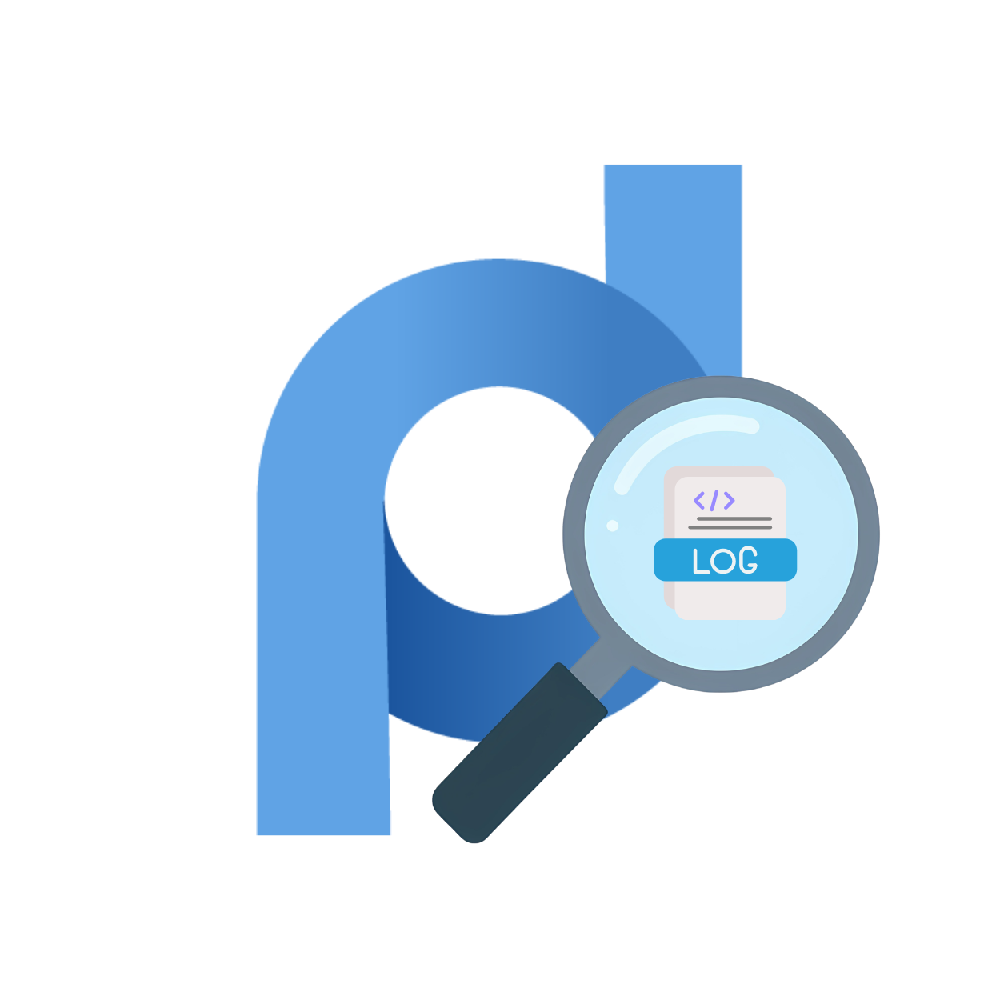
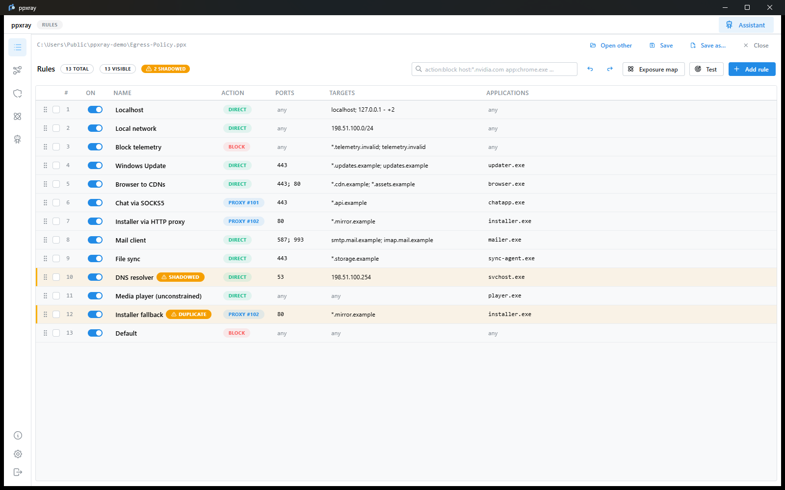
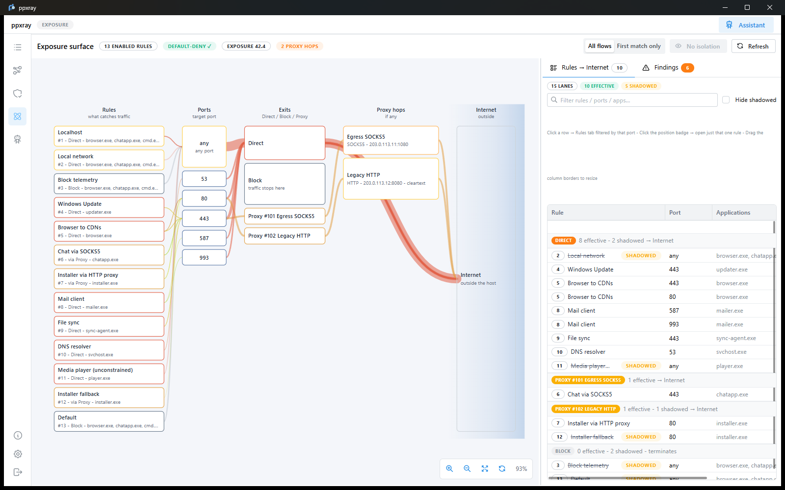
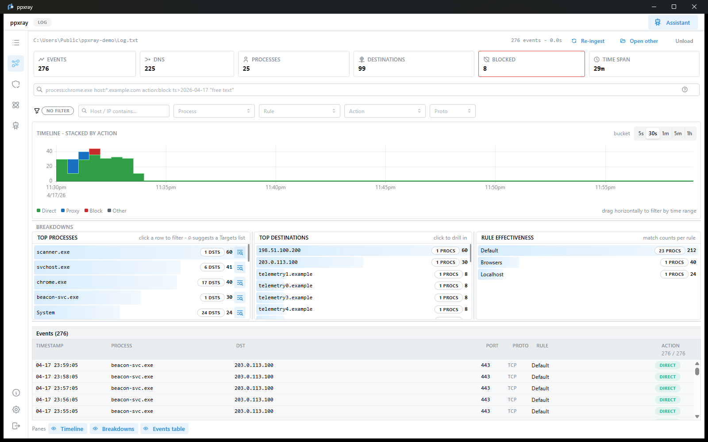
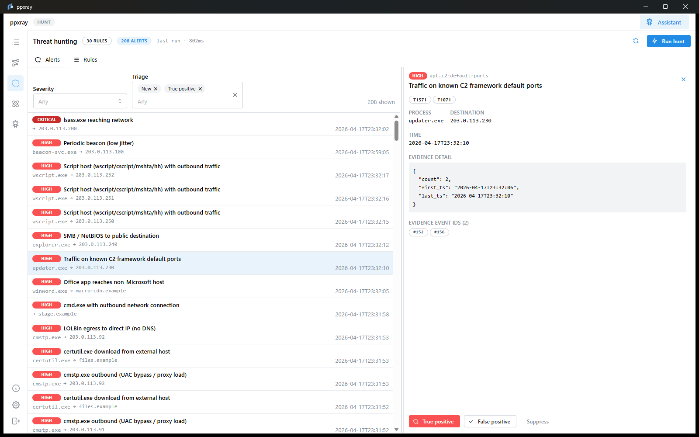

<h1 align="center">
  
  <br>
  ppxray
</h1>

<p align="center">
  <b>Turn Proxifier into a per-process network monitor that tells you when something on your machine starts talking to somewhere it shouldn't.</b>
</p>

<p align="center">
  <a href="https://github.com/Vibe-Coding-Base/PPXray/actions/workflows/ci.yml"></a>
  <a href="LICENSE"></a>
  
  
  
</p>

---

## Why

Most people point Proxifier at a SOCKS5 and forget it. This tool is for the
other use case: running Proxifier as a **per-process egress policy** for your
own machine.

Used that way, your `.ppx` rule list stops being a routing table and becomes
an access-control policy — *firefox.exe may reach these hosts direct, cmd.exe
and anything unlisted hits the default Block rule.* And the Proxifier log
stops being noise and becomes per-process network telemetry: every connection
attempt and DNS query, with the owning executable attached.

That is enough signal to catch a compromise early. Malware has to reach the
network eventually, and when it does, it does so as a named process — one
that either has no business being on the wire, or is reaching somewhere it
never has before. Proxifier records all of it and gives you no way to look.

Two gaps make that hard in practice, and ppxray closes both:

- **You cannot see holes in your own policy.** One broad rule near the top of
  the list — a `Direct` action with no application constraint, or a specific
  rule shadowed by an earlier catch-all — silently opens a lane anything can
  walk through. Proxifier's editor will not tell you.
- **The log is a firehose with no analytics.** *Which process beaconed to a
  public IP every 60 seconds last night?* is not a question you can ask it.

## What it does

|  | |
| --- | --- |
| **Rules** | Lossless `.ppx` editing — drag-drop reorder, bulk ops, undo/redo, search DSL, a rule tester, and shadow detection that explains *why* one rule covers another (targets / applications / ports → `Any` / `Covers` / `Identical`). |
| **Exposure** | What your enabled rules actually let out, as a flow diagram: which rules reach the internet, through which ports and proxies, and which findings deserve attention. |
| **Log** | Stream-parses Proxifier `.txt` logs into a local DuckDB store — timeline, top-N breakdowns, and a virtualized event table where every cell pivots the filter. |
| **Hunt** | Runs 30 built-in detections over that traffic — LOLBin egress, beaconing, DNS tunnelling, LSASS outbound, Office-macro payloads, C2 default ports, remote-admin tools, mining pools, webshell callbacks — plus any YAML rule you drop in. Alerts land in a triage inbox with evidence event IDs and MITRE ATT&CK tags. |
| **Assistant** | Optional, off by default. Asks questions of the log by writing SQL that runs locally, explains a rule, or reviews a log for outliers — at a privacy level you choose, defaulting to one that sends no log content at all. |

Your Proxifier rules are the preventive layer. These detections are the
detective layer that catches what got through.

## Screens

<p align="center">
  
  <br>
  <sub><b>Rules</b> — the profile as an editable policy. Rule 10 is flagged
  <code>SHADOWED</code> because an earlier rule already catches it, and rule 12
  <code>DUPLICATE</code> because it repeats rule 7.</sub>
</p>

<p align="center">
  
  <br>
  <sub><b>Exposure</b> — every lane from a rule to the internet, through which
  port and which proxy. Here two rules exit through a cleartext HTTP proxy,
  which is one of the six findings on the right.</sub>
</p>

<p align="center">
  
  <br>
  <sub><b>Log</b> — the log as per-process telemetry. Every cell in the table
  pivots the filter, and <code>beacon-svc.exe</code> hitting one address once a
  minute is visible before any rule has run.</sub>
</p>

<p align="center">
  
  <br>
  <sub><b>Hunt</b> — 30 detections over that traffic, with the evidence event
  ids and ATT&CK techniques behind each alert, and a triage decision attached
  to it.</sub>
</p>

> Screenshots use generated test data — every host is `.example` or
> `.invalid`, every address is from RFC 5737 / RFC 3849. See
> [`testdata/`](testdata/).

## Install

Download from [Releases](https://github.com/Vibe-Coding-Base/PPXray/releases):

| OS | Artifact |
| --- | --- |
| Windows | `ppxray_<version>_x64_en-US.msi` |
| macOS (Apple Silicon) | `ppxray_<version>_aarch64.dmg` |
| macOS (Intel) | `ppxray_<version>_x64.dmg` |
| Linux | `ppxray_<version>_amd64.AppImage` / `.deb` |

> **Installers are not code-signed.** Verify the SHA-256 against the release
> notes before running. [`docs/DISTRIBUTION.md`](docs/DISTRIBUTION.md) has the
> per-OS procedure.

## Build

```sh
git clone https://github.com/Vibe-Coding-Base/PPXray.git
cd ppxray
pnpm install
pnpm dev      # Tauri dev with live reload
pnpm build    # production bundle
```

Rust 1.85+, Node 22+, pnpm 10+, and the Tauri v2 system dependencies. The
first build compiles DuckDB from source and takes a few minutes.
[`docs/DEV-SETUP.md`](docs/DEV-SETUP.md) covers the rest.

ppxray ships no sample profile or log. Test fixtures live in `testdata/` and
are generated by `tools/gen-sample-log.py` from RFC 5737 / RFC 3849
documentation addresses — never trimmed from a real capture — and `.gitignore`
refuses `*.ppx` and Proxifier logs.

## Privacy

Everything stays on your machine. No telemetry, no analytics, no accounts.

Out of the box the app makes exactly one network request, and only when you
press **Settings → Check for updates**: it asks the GitHub release channel
whether a newer version exists. There is no background poll. Update bundles are
verified against a key compiled into the binary before anything is installed.

The one thing that can add a second request is the **Assistant**, and it is off
until you turn it on. When you do:

- The default privacy level sends the database *schema* and your question — no
  values. The model writes SQL, ppxray runs it locally, and the results are
  shown to you alone; the model is told only the row count and column names.
  Two further levels share query results, masked or unmasked, and you pick.
- The recommended endpoint is a local one (Ollama, llama.cpp, LM Studio), where
  nothing leaves the machine at all. Anthropic and any OpenAI-compatible API
  also work.
- Your API key goes to the OS credential store, never to `settings.json`.
- Nothing is sent until you have read one request in full, byte for byte, and
  every request — including the ones ppxray refuses to send — is appended to
  `llm-audit.jsonl` with its endpoint, size and SHA-256.

That is enforced, not just intended: detection rules are SQL, so the DuckDB
connection opens with external file and network access revoked and the
configuration locked, and
[`crates/log-ingest/tests/sandbox.rs`](crates/log-ingest/tests/sandbox.rs)
fails the build if that stops holding. It matters because rule packs are
meant to be shared, and importing someone's `.yml` means running their SQL.

Analysis databases live under your OS app-data directory and can be deleted
at any time.

## Architecture

```
React 19 + Mantine  ──  @ppxray/ipc-schema (types generated from Rust)
        │ invoke / events
Tauri v2 host (Rust)
        │
        ├─ ppx-core       parse + serialize .ppx, exposure analysis
        ├─ log-ingest     streaming log parser + DuckDB store and queries
        ├─ detect-engine  detection catalog, rule runner, alert storage
        └─ llm-bridge     opt-in assistant: providers, redaction, egress audit
                              │
                          DuckDB — one file per analysed log
```

[`docs/ARCHITECTURE.md`](docs/ARCHITECTURE.md) covers the boundaries that
matter: the SQL sandbox, the schema-rebuild policy, why the event tables carry
no indexes, and where the assistant's data boundary is enforced.

## Contributing

[`CONTRIBUTING.md`](CONTRIBUTING.md). The most useful contribution is a new
detection — a YAML file in your rule directory, or a `rule!` entry in
[`crates/detect-engine/src/builtin.rs`](crates/detect-engine/src/builtin.rs).
Every built-in runs against a fixture in CI, so a broken one fails the build
rather than silently detecting nothing.

## Security

[`SECURITY.md`](SECURITY.md) for responsible disclosure.

## License

[MIT](LICENSE).
